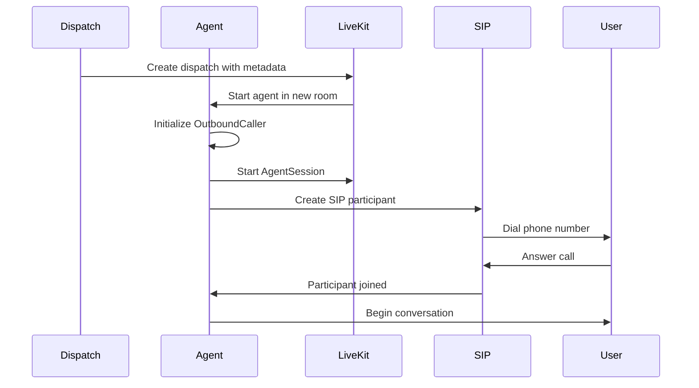

# Making Calls

This guide explains how the outbound calling workflow operates and how to customize it.

## Call Flow Overview



## Dispatching a Call

Calls are initiated by dispatching the agent with metadata:

```bash
lk dispatch create \
  --new-room \
  --agent-name outbound-caller \
  --metadata '{"phone_number": "+1234567890", "transfer_to": "+9876543210"}'
```

### Dispatch Metadata

The metadata JSON object contains:

| Field | Type | Description |
|-------|------|-------------|
| `phone_number` | string | The number to call (E.164 format recommended) |
| `transfer_to` | string | Number for human operator transfers |

## Entrypoint Function

The `entrypoint` function orchestrates the call:

```python
async def entrypoint(ctx: JobContext):
    # Connect to the room
    await ctx.connect()

    # Parse dial information from metadata
    dial_info = json.loads(ctx.job.metadata)
    phone_number = dial_info["phone_number"]

    # Create the agent
    agent = OutboundCaller(
        name="Jayden",
        appointment_time="next Tuesday at 3pm",
        dial_info=dial_info,
    )

    # Configure the session
    session = AgentSession(
        turn_detection=EnglishModel(),
        vad=silero.VAD.load(),
        stt=deepgram.STT(),
        tts=cartesia.TTS(),
        llm=openai.LLM(model="gpt-4o"),
    )

    # Start session before dialing
    session_started = asyncio.create_task(
        session.start(
            agent=agent,
            room=ctx.room,
            room_input_options=RoomInputOptions(
                noise_cancellation=noise_cancellation.BVCTelephony(),
            ),
        )
    )

    # Dial the user
    await ctx.api.sip.create_sip_participant(...)
```

## SIP Participant Creation

The call is initiated using the LiveKit SIP API:

```python
await ctx.api.sip.create_sip_participant(
    api.CreateSIPParticipantRequest(
        room_name=ctx.room.name,
        sip_trunk_id=outbound_trunk_id,
        sip_call_to=phone_number,
        participant_identity=participant_identity,
        wait_until_answered=True,
    )
)
```

### Parameters

| Parameter | Description |
|-----------|-------------|
| `room_name` | The LiveKit room for the call |
| `sip_trunk_id` | Your configured SIP trunk ID |
| `sip_call_to` | The phone number to dial |
| `participant_identity` | Identifier for the participant |
| `wait_until_answered` | Block until the call is answered |

## Handling Call States

### Call Answered

When the user answers, the agent starts the conversation:

```python
participant = await ctx.wait_for_participant(identity=participant_identity)
agent.set_participant(participant)
```

### Call Failed

If the call fails (busy, no answer, etc.), handle the error:

```python
try:
    await ctx.api.sip.create_sip_participant(...)
except api.TwirpError as e:
    logger.error(
        f"error creating SIP participant: {e.message}, "
        f"SIP status: {e.metadata.get('sip_status_code')}"
    )
    ctx.shutdown()
```

## Session Configuration

### Pipelined Mode

Uses separate STT, LLM, and TTS models:

```python
session = AgentSession(
    turn_detection=EnglishModel(),
    vad=silero.VAD.load(),
    stt=deepgram.STT(),
    tts=cartesia.TTS(),
    llm=openai.LLM(model="gpt-4o"),
)
```

### Realtime Mode

Uses OpenAI's speech-to-speech model:

```python
session = AgentSession(
    llm=openai.realtime.RealtimeModel()
)
```

## Noise Cancellation

The agent uses Krisp for noise cancellation:

```python
room_input_options=RoomInputOptions(
    noise_cancellation=noise_cancellation.BVCTelephony(),
)
```

## Customizing Call Behavior

### Custom Agent Instructions

Modify the agent's system prompt:

```python
agent = OutboundCaller(
    name="Jayden",
    appointment_time="next Tuesday at 3pm",
    dial_info=dial_info,
)
```

The agent uses these parameters in its instructions template.

### Programmatic Dispatch

You can also dispatch calls programmatically using the LiveKit API:

```python
from livekit import api

client = api.LiveKitAPI()
await client.agent.dispatch_agent(
    api.CreateAgentDispatchRequest(
        agent_name="outbound-caller",
        room_name="my-room",
        metadata='{"phone_number": "+1234567890", "transfer_to": "+9876543210"}',
    )
)
```

## Next Steps

- [Function Tools](function-tools.md): Learn about available agent capabilities
- [Call Transfers](call-transfers.md): Configure transfers to human operators
- [Voicemail Detection](voicemail-detection.md): Handle voicemail scenarios
